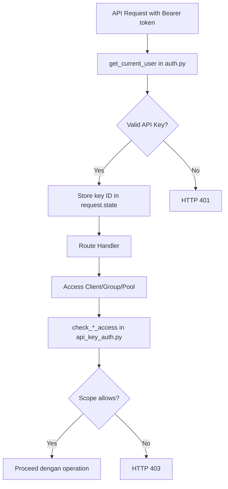

# API Key Scope Restrictions - Implementation Summary

## Completed Backend Implementation

### Database Layer ✅
- **Migration Created**: [20260324120000_add_api_key_scopes.py](/workspaces/managed-nebula/server/ale mbic/versions/20260324120000_add_api_key_scopes.py)
  - Added `api_key_groups` association table
  - Added `api_key_ip_pools` association table
  - Added `restrict_to_created_clients` boolean field to `user_api_keys`
  - Added `parent_key_id` field for tracking key regeneration
  - Added `created_by_api_key_id` field to `clients` table
  - All changes are idempotent

### Models ✅
- **UserAPIKey** (server/app/models/api_key.py):
  - Added `restrict_to_created_clients` field
  - Added `parent_key_id` foreign key
  - Added `allowed_groups` relationship
  - Added `allowed_ip_pools` relationship
  - Added `parent_key` relationship

- **Client** (server/app/models/client.py):
  - Added `created_by_api_key_id` foreign key with index

### Services ✅
- **api_key_auth.py** (NEW): Complete authorization service
  - `check_client_access()`: Validates API key has permission to access a client
  - `check_group_access()`: Validates API key has permission to access a group
  - `check_ip_pool_access()`: Validates API key has permission to access an IP pool
  - `filter_clients_by_scope()`: Filters client lists based on key restrictions
  - `require_*_access()`: Authorization enforcement with HTTP 403 exceptions

- **api_key_manager.py**: Extended with scope support
  - `create_api_key()`: Now accepts group IDs, IP pool IDs, restrict_to_created_clients
  - `regenerate_api_key()`: NEW - Maintains all permissions from original key
  - `update_api_key()`: Now supports updating scope restrictions
  - `get_user_api_keys()`: Loads relationships with selectinload
  - `get_api_key_by_id()`: Loads relationships with selectinload

### API Schemas ✅
- Added `IPPoolRef` to shared schemas
- Updated `APIKeyCreate`:
  - Added `allowed_group_ids`
  - Added `allowed_ip_pool_ids`
  - Added `restrict_to_created_clients`

- Updated `APIKeyResponse` & `APIKeyCreateResponse`:
  - Added `restrict_to_created_clients`
  - Added `parent_key_id`
  - Added `allowed_groups` (list of GroupRef)
  - Added `allowed_ip_pools` (list of IPPoolRef)

- Updated `APIKeyUpdate`: Same fields as create (all optional)

### API Endpoints ✅
- **POST /api-keys**: Now accepts scope restriction parameters
- **GET /api-keys**: Returns keys with scope information
- **GET /api-keys/{id}**: Returns key with scope information
- **PUT /api-keys/{id}**: Can update scope restrictions
- **POST /api-keys/{id}/regenerate**: NEW - Creates new key with same permissions
- **POST /clients**: Tracks `created_by_api_key_id` when created via API key

### Authentication ✅
- Updated `get_current_user()` in core/auth.py:
  - Stores `request.state.api_key_id` when authenticated via API key
  - Stores `request.state.api_key` with full key object for authorization
- Added `get_current_api_key_id()` helper function

## Completed Frontend Implementation

### TypeScript Models ✅
- Added `IPPoolRef` interface
- Updated `APIKey` interface with new fields
- Updated `APIKeyCreate`, `APIKeyCreateResponse`, `APIKeyUpdate` interfaces

### API Service ✅
- Updated `createAPIKey()` to accept scope parameters
- Updated `updateAPIKey()` to accept scope parameters
- Added `regenerateAPIKey()` method

## Frontend UI Updates Needed

### Profile Component (frontend/src/app/components/profile.component.ts)

#### Additional Component Properties Needed:
```typescript
// Add to ProfileComponent class:
availableGroups: Group[] = [];
availableIPPools: IPPool[] = [];
selectedGroupIds: number[] = [];
selectedIPPoolIds: number[] = [];
restrictToCreatedClients: boolean = false;
loadingGroups = false;
loadingPools = false;
```

#### Methods to Add/Update:

1. **loadGroups()**: Load available groups for multi-select
```typescript
loadGroups(): void {
  this.loadingGroups = true;
  this.api.getGroups().subscribe({
    next: (response) => {
      this.availableGroups = response;
      this.loadingGroups = false;
    },
    error: () => {
      this.loadingGroups = false;
      alert('Failed to load groups');
    }
  });
}
```

2. **loadIPPools()**: Load available IP pools for multi-select
```typescript
loadIPPools(): void {
  this.loadingPools = true;
  this.api.getIPPools().subscribe({
    next: (response) => {
      this.availableIPPools = response;
      this.loadingPools = false;
    },
    error: () => {
      this.loadingPools = false;
      alert('Failed to load IP pools');
    }
  });
}
```

3. **Update createAPIKey()**: Include scope parameters
```typescript
createAPIKey(): void {
  // ... existing validation ...
  
  const payload: any = {
    name: this.newKeyName.trim(),
    restrict_to_created_clients: this.restrictToCreatedClients
  };
  
  if (this.newKeyExpiresInDays) {
    payload.expires_in_days = this.newKeyExpiresInDays;
  }
  
 if (this.selectedGroupIds.length > 0) {
    payload.allowed_group_ids = this.selectedGroupIds;
  }
  
  if (this.selectedIPPoolIds.length > 0) {
    payload.allowed_ip_pool_ids = this.selectedIPPoolIds;
  }
  
  // ... rest of method...
}
```

4. **Add regenerateAPIKey()**: Handle key regeneration
```typescript
regenerateAPIKey(key: APIKey): void {
  const msg = `Regenerate API key "${key.name}"? This will:\n\n` +
    `• Create a new key with the same permissions\n` +
    `• Deactivate the current key\n` +
    `• Show you the new key only once\n\n` +
    `Continue?`;
  
  if (confirm(msg)) {
    this.api.regenerateAPIKey(key.id).subscribe({
      next: (response: APIKeyCreateResponse) => {
        this.newlyCreatedKey = response;
        this.loadAPIKeys();
        alert('Key regenerated successfully!');
      },
      error: (e) => {
        alert('Failed to regenerate key: ' + (e?.error?.detail || 'Unknown error'));
      }
    });
  }
}
```

5. **Update showCreateKeyForm trigger**: Load options when form opens
```typescript
// Update the button click handler to:
openCreateKeyForm(): void {
  this.showCreateKeyForm = true;
  this.loadGroups();
  this.loadIPPools();
  // Reset form
  this.selectedGroupIds = [];
  this.selectedIPPoolIds = [];
  this.restrictToCreatedClients = false;
}
```

#### Template Updates Needed:

Insert after the "Expires In" field in the create form:

```html
<!-- Group Restrictions -->
<div class="form-group">
  <label>Allowed Groups (optional)</label>
  <select multiple class="form-control" name="allowed_groups" [(ngModel)]="selectedGroupIds" size="5">
    <option *ngFor="let group of availableGroups" [value]="group.id">{{ group.name }}</option>
  </select>
  <small>Leave empty to allow all groups. Hold Ctrl/Cmd to select multiple.</small>
</div>

<!-- IP Pool Restrictions -->
<div class="form-group">
  <label>Allowed IP Pools (optional)</label>
  <select multiple class="form-control" name="allowed_pools" [(ngModel)]="selectedIPPoolIds" size="5">
    <option *ngFor="let pool of availableIPPools" [value]="pool.id">{{ pool.cidr }}</option>
  </select>
  <small>Leave empty to allow all IP pools. Hold Ctrl/Cmd to select multiple.</small>
</div>

<!-- Restrict to Created Clients -->
<div class="form-group">
  <label class="checkbox-label">
    <input type="checkbox" name="restrict_clients" [(ngModel)]="restrictToCreatedClients" />
    Restrict to clients created by this key
  </label>
  <small>If checked, this key can only access clients it creates</small>
</div>
```

Update the actions column in the API keys table to add a Regenerate button:

```html
<td>
  <!-- Existing revoke button -->
  <button class="btn btn-sm btn-danger" (click)="confirmRevokeKey(key)">Revoke</button>
  <!-- Add regenerate button -->
  <button class="btn btn-sm btn-secondary" (click)="regenerateAPIKey(key)" 
          [disabled]="!key.is_active" title="Create new key with same permissions">
    Regenerate
  </button>
</td>
```

Add scope indicators in the table (new columns or expandable row):

```html
<!-- Add after "Last Used" column in table -->
<th>Restrictions</th>

<!-- In tbody <tr> -->
<td>
  <div *ngIf="key.allowed_groups.length > 0" class="badge badge-info">
    {{ key.allowed_groups.length }} group(s)
  </div>
  <div *ngIf="key.allowed_ip_pools.length > 0" class="badge badge-info">
    {{ key.allowed_ip_pools.length }} pool(s)
  </div>
  <div *ngIf="key.restrict_to_created_clients" class="badge badge-warning">
    Created clients only
  </div>
  <div *ngIf="key.allowed_groups.length === 0 && key.allowed_ip_pools.length === 0 && !key.restrict_to_created_clients" 
       class="text-muted">
    None
  </div>
</td>
```

## Testing Needed

### Backend Tests (server/tests/test_api_keys.py)
Add test cases for:
- Creating API key with group restrictions
- Creating API key with IP pool restrictions
- Creating API key with restrict_to_created_clients
- Regenerating API key maintains permissions
- Scope authorization checks (client access validation)

### Frontend Testing
- Manual testing of create form with scope dropdowns
- Verify regenerate button creates new key
- Verify scope restrictions display correctly in list
- Test updating key scope restrictions

## Documentation Updates Needed

### API_KEY_GUIDE.md
Add sections covering:
1. **Scope Restrictions Overview**
2. **Restricting by Groups** (with examples)
3. **Restricting by IP Pools** (with examples)
4. **Restricting to Created Clients** (with examples)
5. **Regenerating API Keys**
6. **Authorization Behavior** (403 errors when scope violated)

## Next Steps

1. **Complete frontend UI implementation** following the patterns above
2. **Run database migration**: `docker exec -it nebula-server alembic upgrade head`
3. **Add comprehensive tests** for scope restrictions
4. **Update API_KEY_GUIDE.md** with new features
5. **Test end-to-end** workflow:
   - Create restricted key
   - Attempt operations outside scope (verify 403)
   - Regenerate key
   - Verify permissions maintained

## Key Design Decisions

1. **Regeneration Preserves Permissions**: When regenerating, the new key inherits all scope restrictions from the parent key
2. **Empty Lists = No Restriction**: If `allowed_groups` or `allowed_ip_pools` is empty/null, the key has access to all resources (within user's permissions)
3. **Client Tracking**: Clients track which API key created them via `created_by_api_key_id` for proper scope enforcement
4. **Request State Tracking**: API key ID stored in `request.state` during authentication for transparent tracking throughout request lifecycle
5. **Idempotent Migrations**: All database migrations use helper functions to check existence before creating/dropping objects

## Files Modified/Created

### Backend:
- NEW: server/alembic/versions/20260324120000_add_api_key_scopes.py
- NEW: server/app/services/api_key_auth.py
- MODIFIED: server/app/models/api_key.py
- MODIFIED: server/app/models/client.py
- MODIFIED: server/app/models/schemas.py
- MODIFIED: server/app/services/api_key_manager.py
- MODIFIED: server/app/routers/api.py
- MODIFIED: server/app/core/auth.py

### Frontend:
- MODIFIED: frontend/src/app/models/index.ts
- MODIFIED: frontend/src/app/services/api.service.ts
- TODO: frontend/src/app/components/profile.component.ts (needs full implementation)

## Authorization Flow


